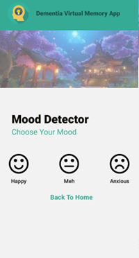
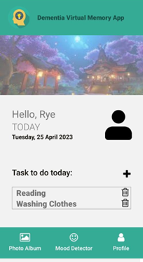

# Dementia Virtual Memory App
Dementia Virtual Memory App is a mobile-based memory-storing app that can help users store their memory.

## Getting Started
Dementia Virtual Memory App involves 3 main modules: Photo Album, Daily Task and Mood Detector. 

### Target Users
Dementia Patients and their caregivers.

### Photo Album

This feature allows users to view, add and delete photos. 

### Mood Detector

This feature allows users to keep track of their mood. If the user presses on the anxious mood, a message will be sent to notify the users' caregiver. 

### Daily Task

This feature will allow the user to view, add and delete daily task to do. 

